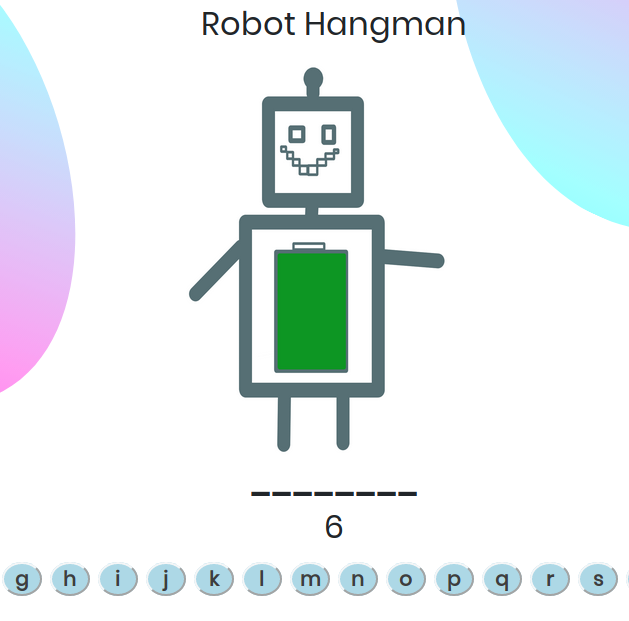

## JavaScript Project
## Hangman :video_game:
The aim is to create a hangman game using JavaScript.  
There are words to guess, the user needs to click on a letter to try to guess the word, if the letter is not in the word, then the user looses a life.

### Motivation?
Project coming from BeCode Brussels as part of our training.  

### Collaborator :dancers:
- [Jinane](https://github.com/Zjinane)

### Learning goals
- consolidate JavaScript knowledge
- use our knowledge in CSS,SCSS to make the design look nice.

### Overview

### Tools used
- HTML,SASS
- JavaScript
- Krita for robots drawings
- Canva for background image

### Progression
- need to disable the buttons when the user has already clicked on it
- update the word to guess once the user guesses de word right
- if the user doesn't guess the word right, or if he guesses the word then the mystery word needs to be displayed  
Any comments are welcome!  :point_left:

### Credits 
October 2019  
Made in Belgium  🇧🇪